# 🍽️ **HungerHut – Online Food Delivery Service**

HungerHut is a full-stack online food delivery platform where users can browse restaurants, order food, make payments, and track their orders.
The system includes a **User Frontend**, **Admin Dashboard**, and **Backend API**.

---

## 🚀 **Tech Stack Used**

### **Frontend (User & Admin)**

* **React.js**
* **React Router**
* **Context API / Redux (if used)**
* **Axios**
* **Tailwind CSS / CSS Modules**

### **Backend**

* **Node.js**
* **Express.js**
* **MongoDB (Mongoose ORM)**
* **JWT Authentication**
* **BCrypt / Crypto**
* **Multer (for image upload)**
* **Cloudinary or Local Storage (image handling)**

### **Other Tools**

* **Git & GitHub**
* **Postman (API testing)**
* **Vercel / Render / Railway for hosting**

---

## ⚙️ **Project Structure**

```
HungerHut/
│── backend/          → Node.js + Express API
│── user-frontend/    → React.js user-side application
│── admin-frontend/   → React.js admin dashboard
│── README.md
```

---

## 🛠️ **Setup Instructions**

Follow these steps to run the project locally.

---

## 1️⃣ **Clone the Repository**

```bash
git clone https://github.com/AyushGupta915/HungerHut
cd HungerHut
```

---

## 2️⃣ **Setup Backend**

```
cd backend
npm install
```

### Create a `.env` file:

```
PORT=5000
MONGO_URI=your_mongodb_connection_string
JWT_SECRET=your_jwt_secret
CLOUDINARY_NAME=your_name  (optional)
CLOUDINARY_API_KEY=your_key (optional)
CLOUDINARY_API_SECRET=your_secret (optional)
```

### Run backend server:

```
npm run server
```

Backend will run on:
👉 **[http://localhost:5000](http://localhost:5000)**

---

## 3️⃣ **Setup User Frontend**

```
cd ../user-frontend
npm install
npm start
```

User app will run on:
👉 **[http://localhost:3000](http://localhost:3000)**

---

## 4️⃣ **Setup Admin Frontend**

```
cd ../admin-frontend
npm install
npm start
```

Admin dashboard will run on:
👉 **[http://localhost:3001](http://localhost:3001)** (or whichever port React chooses)

---

## 🧪 **Optional: Build for Production**

User frontend:

```
npm run build
```

Admin frontend:

```
npm run build
```

---

## 📦 **API Features**

* User registration & login
* Restaurant & food listing
* Cart management
* Order creation
* Order status tracking
* Admin: Add/edit/delete menu items
* Image uploads

---

## 🌐 **Deployment**

You can deploy:

* **Frontend** → Vercel
* **Backend** → Render, Railway, or Cyclic
* **Database** → MongoDB Atlas

<p align="center">
  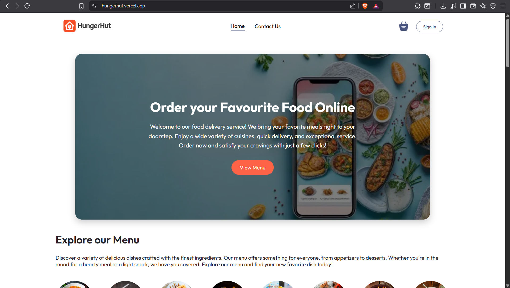
  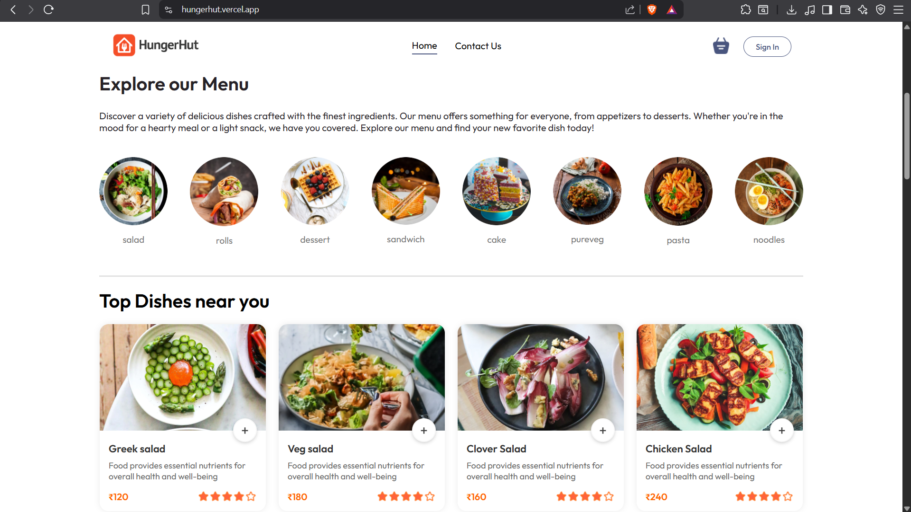
  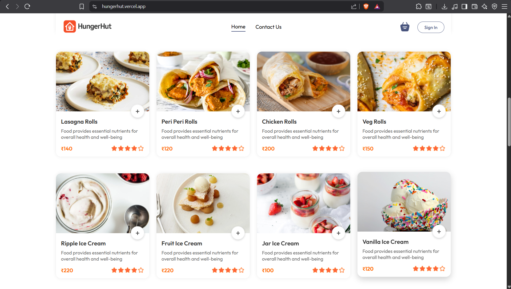
  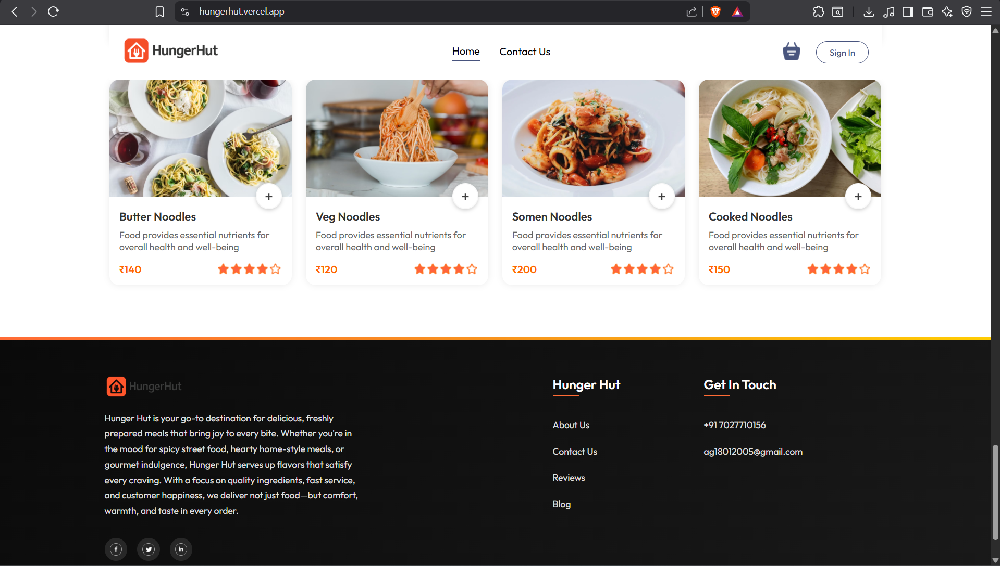
</p>

<p align="center">
  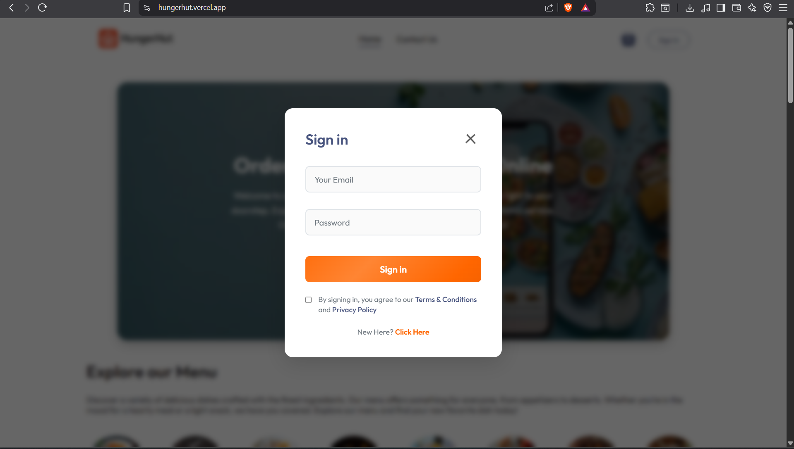
  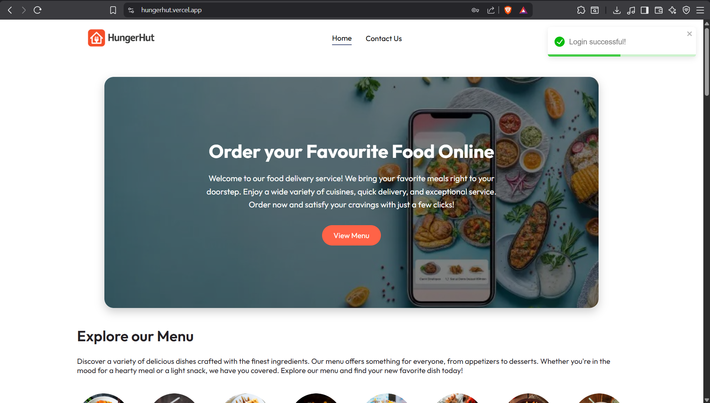
  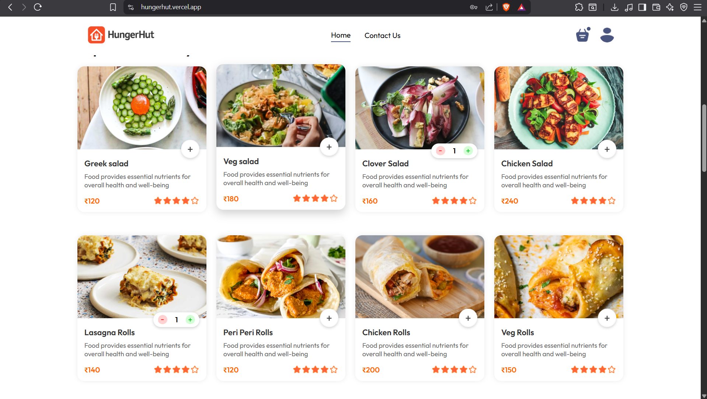
  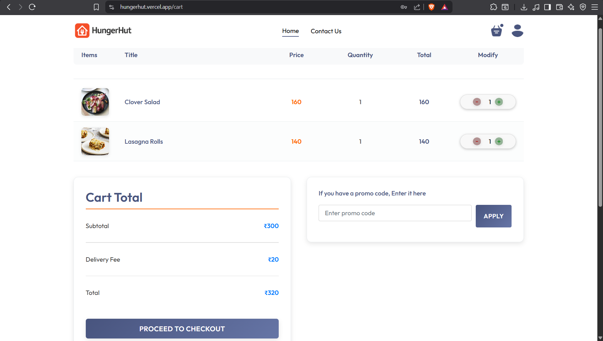
</p>

<p align="center">
  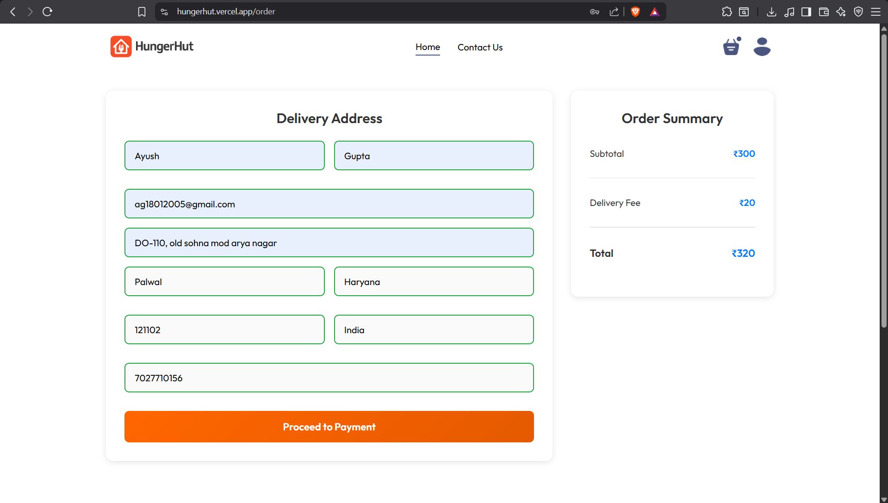
  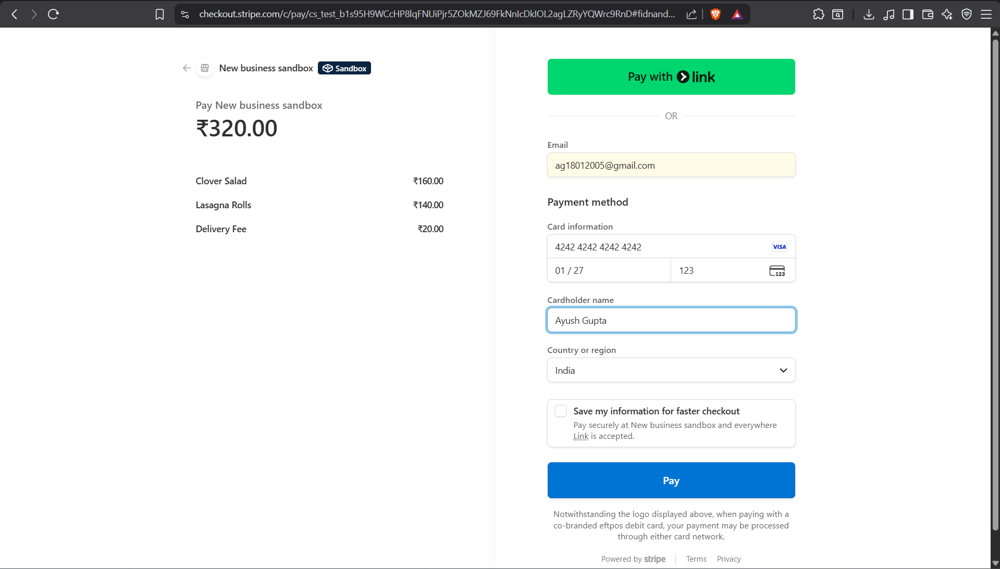
  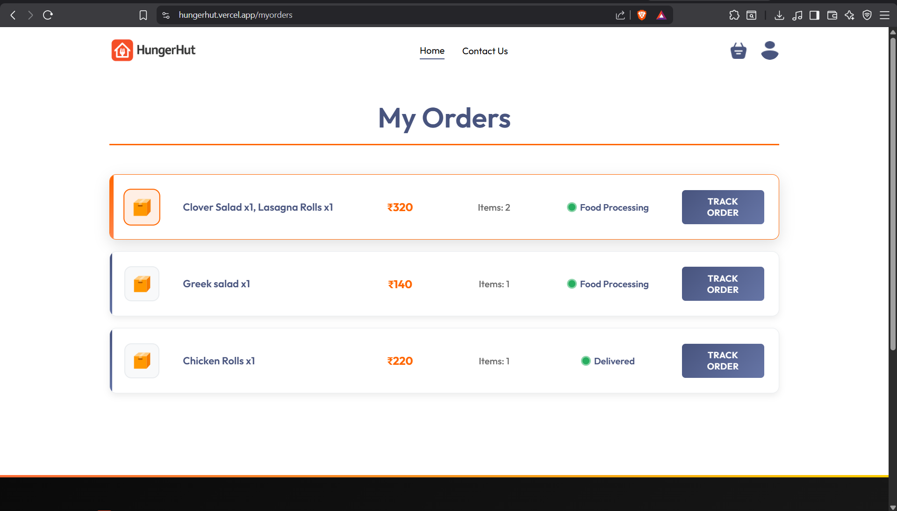
  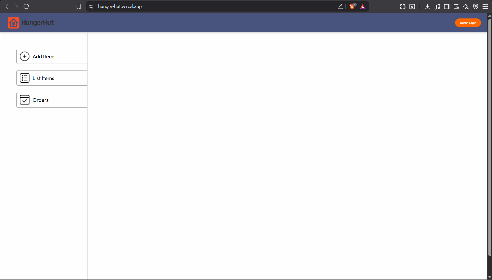
</p>

<p align="center">
  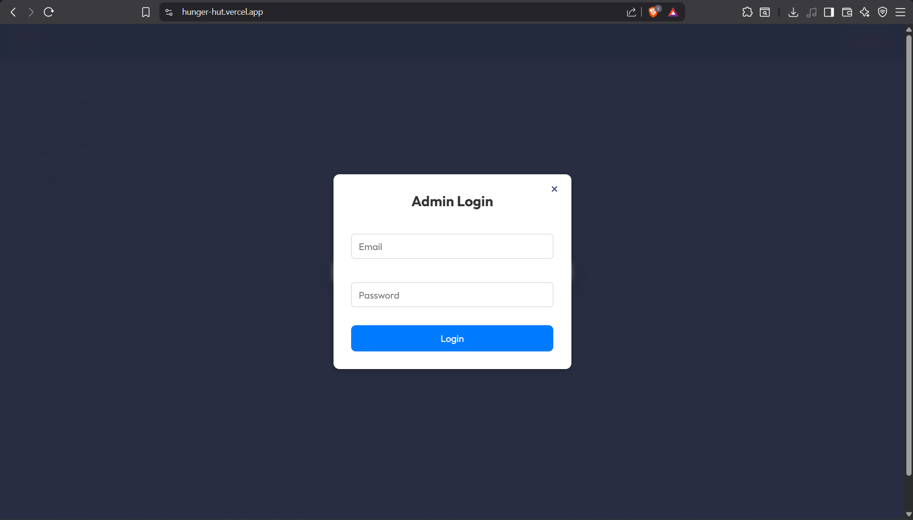
  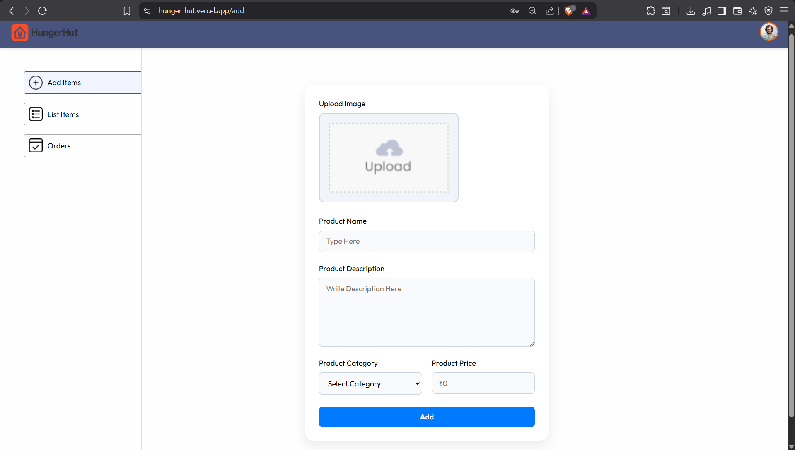
  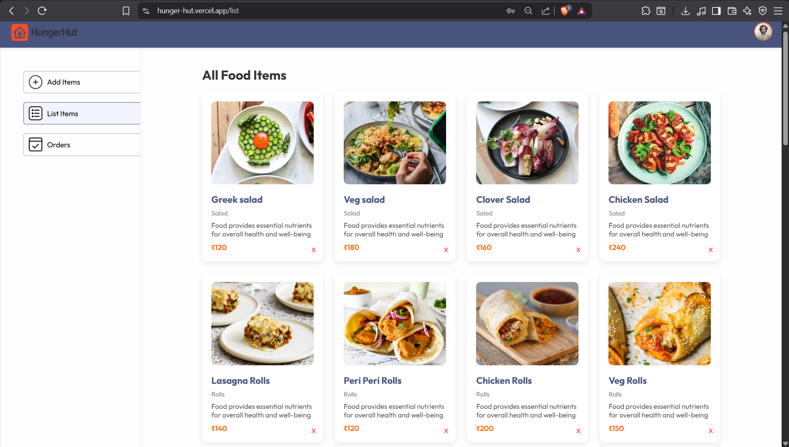
  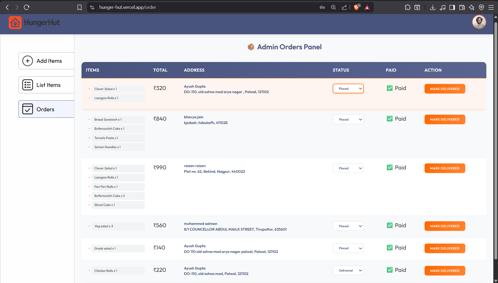
</p>
